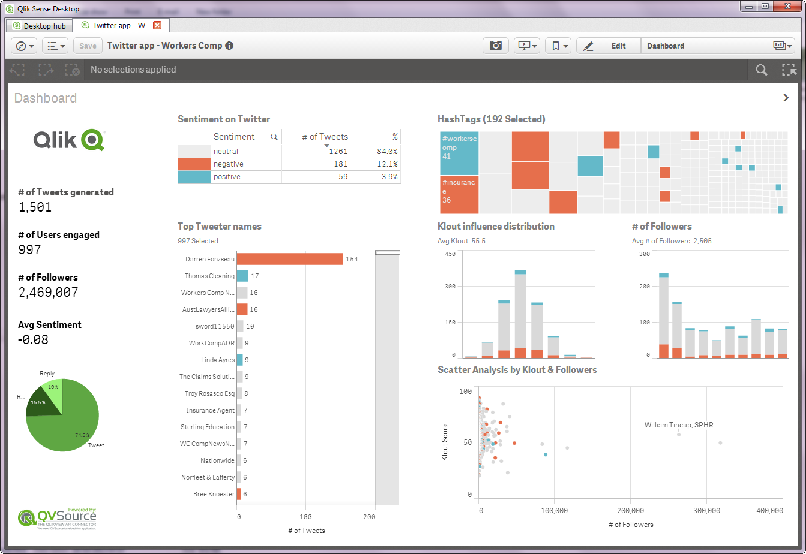

QVSource Twitter Starter App For Qlik Sense
===========================================
**IMPORTANT** - If you are using QVSource 1.6.5.3 or later you will need to update the parts of the load script in this application which use the [Sentiment Analysis & Text Analytics Connector](http://wiki.qvsource.com/Sentiment-Analysis-And-Text-Analytics-Connector-For-QlikView.ashx) according to the instructions [here](http://wiki.qvsource.com/Upgrading-to-version-1_1-of-the-Sentiment-Analysis-And-Text-Analytics-Connector.ashx). We plan to update this starter app soon with these changes.

This is a starter QlikView application pack showing how to get started using the [QVSource Twitter Connector](http://wiki.qvsource.com/Twitter-Connector-For-QlikView.ashx) for QlikView and Qlik Sense.

(This is based on the equivalent application for QlikView which can be found [here](https://github.com/QVSource/QVSource-Twitter-Starter-App-For-QlikView). The main difference in this initial release is that the contents of config.txt have been placed directly into the load script.)

In addition to the Twitter Connector, this application also makes use of the [Sentiment and Text Analytics Connector](http://wiki.qvsource.com/Sentiment-Analysis-And-Text-Analytics-Connector-For-QlikView.ashx) to score Tweets and the [Klout Connector](http://wiki.qvsource.com/Klout-Connector-for-QlikView-%28v2%29.ashx) to measure the influence of Tweeters.

If you are a Qlik Sense + QVSource user you can simply click the ["Download ZIP"](https://github.com/QVSource/QVSource-Twitter-Starter-App-For-Qlik-Sense/archive/master.zip) button on GitHub to grab this application.

The content below is copied from the change log in the first tab of the load script.

NOTE:
* You will need to install the extension twitter_image_table.rar in the \extensions sub folder in order to be able to view the table on the bottom of the details sheet.
* You should copy the files in the /images sub folder to your qlik/sense/content/default directory (e.g. C:\Users\YOUR_USERNAME\Documents\Qlik\Sense\Content\Default).

Change Log
----------
1.0.1 - 17/12/15
----------------
* Made change outlined here [http://wiki.qvsource.com/Upgrading-to-version-1_1-of-the-Sentiment-Analysis-And-Text-Analytics-Connector.ashx] to make app compatible with QVSource Web Editios and QVSource WinForms Edition 1.6.7.0 and later.

1.0.0 - 12/11/14
----------------
* First public release - initial version is based on the equivalent application for QlikView (https://github.com/QVSource/QVSource-Twitter-Starter-App-For-QlikView).
